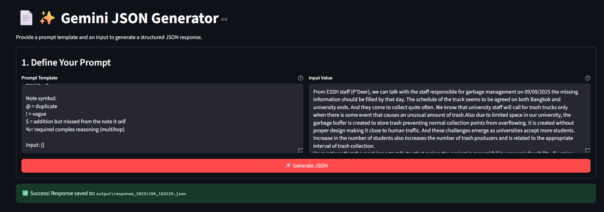
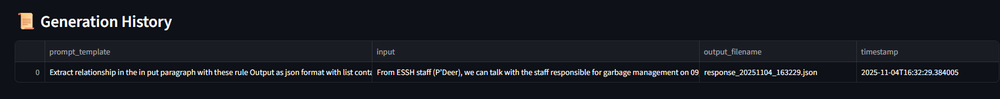
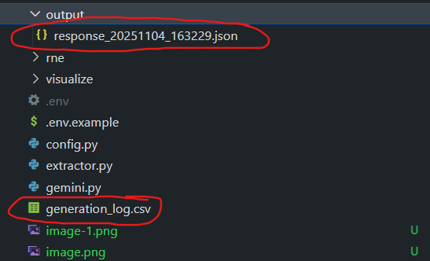

# About
this is tool for ewvaluating extracted causal structure
# folder structure
- source
- lib/output
- gemini.py
- .env
- visualize
# tech stack
- streamlit
# functional
- add prompt and source to UI -> generate output (call from gemini.py) and save to output folder
- read json file from output folder (can select file with drop down)
- pair output and source -> causal extracted
- have button for label (5 level completeness) horizontal radiobox
    - 5: flawless
    - 4: small missing points
    - 3: noticable missing detail
    - 2: critical missing part
    - 1: completely wrong
- localhost only
## UI
1. show raw source
2. list of pair of each raw source with output, buttons
3. OnClick auto save labeled output -> csv

## run command
streamlit run causal_extractor/visualize/visualize.py

# feature
## 1. causal extraction
- source: extract.py
## 2. named entity correction (NEC)
to run this module you needed to be in Causal_extractor then call each main function
# TODO
- other modallity of file: add way to include other type of file, add the file name in the input context, extract file content
- also include generation config?
you can enter data here and just click

log of generation is here

