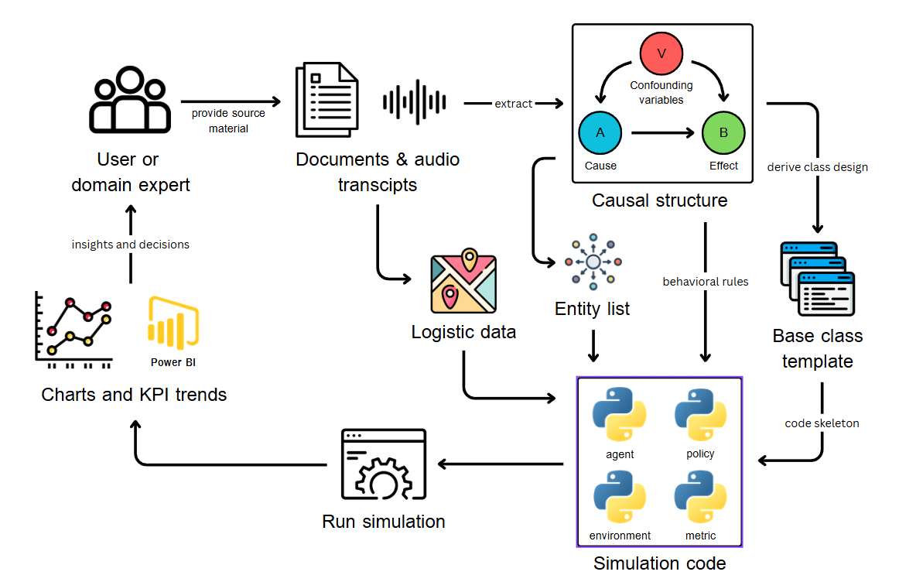

# LLM-Powered Engine for Creating Garbage Flow Simulation

> **Bachelor of Computer Engineering — King Mongkut's University of Technology Thonburi (KMUTT), 2025**
>
- Authors: Kittipob Borisut · Pontakorn Wichaporn · Rapepong Pitijaroonpong
- Advisor: Dr. Aye Hninn Khine · Co-advisor: Dr. Aung Myo Htut

---

## Table of Contents

1. [About This Project](#1-about-this-project)
2. [Architecture](#2-architecture)
3. [Project Hierarchy](#3-project-hierarchy)
4. [Functionalities](#4-functionalities)
   - [Data Extraction](#41-data-extraction)
   - [Code Generation](#42-code-generation)
   - [Policy Testing](#43-policy-testing--not-implemented)
5. [Evaluation Results](#5-evaluation-results)
6. [Future Work](#6-future-work)

---

## 1. About This Project

### Why This Exists

Garbage management initiatives in Thailand — particularly in Bangkok — have received sustained government attention for over a decade, yet their impact is typically measured through indirect metrics (e.g., total waste volume in a bin) that are ambiguous and fail to reflect actual system behaviour. Projects pass procurement on estimated gains, but definitive validation of those gains is only possible after full deployment, by which point sunk costs are already locked in.

**Digital Twin** technology is the theoretically optimal solution: a virtual environment for real-time monitoring, predictive logistics, and scenario comparison before physical commitment. In practice, a high-fidelity Digital Twin requires prohibitive capital expenditure on IoT sensor density and computational infrastructure — a cost ceiling that excludes most institutional waste-management projects.

This project builds a low-cost alternative: an **LLM-powered simulation engine** that translates unstructured stakeholder data (interview transcripts, facility reports, audio recordings) into configurable, predictive simulation models. It enables evidence-based waste management decisions at a fraction of the cost of a full Digital Twin deployment.

**Proof-of-concept scope:** KMUTT campus garbage management, in collaboration with the EESH department. Scaling to other organisations is listed as future work.

### Objectives

1. Create an engine that produces garbage management simulations from system-behaviour descriptions extracted from stakeholder data.
2. Transform qualitative stakeholder knowledge into quantifiable simulation parameters and visualise them
3. Conduct policy testing with different scenarios on KMUTT's garbage management system, evaluating impact.

### How It Works (Overview)

<!-- ```
Stakeholder interviews / facility reports / audio recordings
        │
        ▼  [Data Normalisation]
        │  Audio → Gemini transcription
        │  PowerPoint/PDF → OCR text
        │  Interview notes → manual clean + translate
        │
        ▼  [Causal Extraction Pipeline]
Causal knowledge graph              Physical map images
{head, relationship, tail, detail}  ←──── (campus floor plans)
        │                                        │
        │                               [Map Extraction Pipeline]
        │                               {nodes, edges, weights}
        │                                        │
        └──────────────────┬─────────────────────┘
                           ▼
                [Code Generation Pipeline]
                Python simulation bundle
                  ├── entities/      (actors, resources, places, equipment)
                  ├── environment.py (spatial mediator, map-grounded)
                  ├── policies/      (one class per causal rule)
                  ├── reporter.py    (metric collection)
                  └── run.py         (simulation runner)
                           │
                           ▼  [Simulation Execution]
                  Time-stepped agent simulation
                           │
                           ▼
                  Dashboard — KPIs, overflow metrics, cost/staff analytics
``` -->



**Core insight:** causal triples — `{head, relationship, tail, detail}` facts extracted from interviews, e.g. _"janitors collect waste from trash bins [when bins are full]"_ — map directly onto simulation architecture. Heads and tails become entity classes; relationships become Policy classes. The campus map grounds entity placement spatially so traversal distances and collection routes are physically accurate.

The extraction schema is inspired by N-ary Knowledge Graphs (NKG): standard binary KG triples cannot represent multi-argument relations (e.g., _"A crosses path with B so they hunt C"_). The `detail` field captures modifiers, prepositions, and adverbial context that binary triples discard. Complex n-ary relations are decomposed into multiple linked triples.

**Case study data for this scope:** 2 audio interview recordings, 65 pages of PowerPoint presentations, 3 interview note documents — collected from KMUTT EESH department stakeholders.


---

## 2. Architecture

### System Components

```
┌─────────────────────────────────────────────────────────┐
│                  Desktop Application                    │
│           Electron shell  (engine/desktop/)             │
│                                                         │
│  ┌──────────────────────┐  ┌─────────────────────────┐  │
│  │   Frontend           │  │   Backend               │  │
│  │   Next.js 15         │  │   Python FastAPI        │  │
│  │   engine/web-ui/     │  │   engine/backend/       │  │
│  │                      │  │                         │  │
│  │  ┌────────────────┐  │  │  pipelines/c4/          │  │
│  │  │  SQLite        │  │  │  app/routes/            │  │
│  │  │  local.db      │  │  │  app/services/          │  │
│  │  │  (Drizzle ORM) │  │  │  infra/gemini_client    │  │
│  │  └────────────────┘  │  │                         │  │
│  └──────────────────────┘  └─────────────────────────┘  │
│                                                         │
│             Local file storage  engine/data/            │
│             Pipeline artifacts  engine/output/          │
└─────────────────────────────────────────────────────────┘
                         │
                         ▼
              Google Vertex AI / Gemini API
```

### Key Technology Choices

| Layer | Technology | Why |
|---|---|---|
| Frontend | Next.js 15 (App Router) | React 19 + server components; SSR irrelevant here but tooling maturity |
| Backend | Python FastAPI | Sync-friendly for LLM SDKs; existing team Python expertise |
| Desktop shell | Electron + electron-builder | Wrap web app as local binary; avoids cloud deployment |
| Backend bundling | PyInstaller | Package Python runtime + dependencies into single executable |
| LLM service | Google Vertex AI / Gemini | Multimodal (handles map images + text); long context window for code generation |
| Local DB | SQLite via Drizzle ORM | Zero-config; no server; single file; sufficient for project/job metadata |
| Artifact storage | Local disk (JSON + `.bin`) | Checkpoint durability across crashes; direct file serve |

### Data flow of LLM pipeline
```
User uploads interview PDF / text
        │
        ▼  POST /pipeline/jobs
Backend spawns daemon thread (job_runner.py)
        │
        ▼  Stage loop (map_extract_runner / code_gen_runner)
Each stage → calls Gemini API → saves JSON checkpoint to disk
        │
        ▼  GET /pipeline/jobs/{id}/status  (polling every 1.2s)
Frontend polls status; stage log panel updates live
        │
        ▼  GET /pipeline/jobs/{id}/result
Frontend renders causal graph / entity list / code artifacts
        │
        ▼  SQLite (local.db)
Project metadata, chunks, document records persisted via Drizzle
```

Job state survives backend restarts: checkpoints are on disk; in-memory `JOBS` dict is a cache, not the source of truth.

> **Backend developer guide:** [`engine/backend/README.md`](engine/backend/README.md)
> **Background job architecture deep-dive:** [`docs/background-job-pipeline.md`](docs/background-job-pipeline.md)

---

## 3. Project Hierarchy

```
Garbage-Management-Simulation-Engine/
├── Experiment/                        # Research sandbox — prompt iteration & evaluation
│   ├── causal_extraction/             # Causal extraction experiments & evaluator UI
│   ├── code_generation/               # Code generation experiments
│   │   ├── entity_design/             # Entity class design, LLM judge notebook
│   │   ├── graph_RAG/                 # [LEGACY] Graph-RAG approach (superseded)
│   │   ├── physical_map/              # Map node/edge data used during experiments
│   │   └── simulation_failed_report/  # Documented failure cases
│   ├── follow-up_question/            # Follow-up question generation experiments
│   └── legacy/                        # [LEGACY] Moved here — no longer active
│       ├── causal_lib/                #   Early causal graph library
│       ├── entity_clustering/         #   Replaced by LLM entity grouping
│       └── named_entities_correction/ #   Replaced by pipeline NEC stage
│
├── engine/                            # Production application
│   ├── backend/                       # Python FastAPI server
│   │   ├── app/                       # Routes, services, response schemas
│   │   ├── pipelines/c4/              # C4 pipeline (causal extraction + code gen)
│   │   ├── prompt/                    # All prompt files and prompt replay scripts
│   │   ├── infra/                     # Gemini client, path helpers, env loading
│   │   └── legacy/                    # Old shim files kept for import compatibility
│   ├── web-ui/                        # Next.js frontend
│   │   ├── src/app/                   # App Router pages
│   │   ├── src/lib/                   # DB modules, API clients, utilities
│   │   └── drizzle/                   # SQLite migrations
│   ├── desktop/                       # Electron desktop shell
│   ├── data/                          # Job checkpoint storage (gitignored)
│   └── output/                        # Pipeline run artifacts
│
└── docs/                              # Architecture & design documentation
    ├── Final_report__VIP_.pdf         # Full VIP report (primary reference)
    ├── background-job-pipeline.md     # Job pipeline design recipe
    ├── code-gen-pipeline.md           # Code generation stage design
    ├── generated_code_evaluation_method.md  # LLM judge methodology
    └── entity_map_binding.md          # Entity–map binding plan (in progress)
```

### Why Experiment and Engine Are Separate (The way that we work)

The **Experiment/** folder is the research workspace. It exists so we can:
- Try different prompt strategies without touching production logic
- Collect raw outputs and label them for evaluation
- Draw conclusions about what works before committing to the engine
- Run ablation studies on individual pipeline stages

Once a prompt or approach is validated in Experiment, it gets integrated (or ported) into **engine/**. This prevents half-baked ideas from reaching the production pipeline and keeps the engine code reviewable without noise from exploratory notebooks.

> The `Experiment/legacy/` folder contains approaches that were tried and superseded. They are preserved for reference but are **not part of any active runtime path**.

---

## 4. Functionalities

### 4.1 Data Extraction

#### Causal Extraction

The causal extraction pipeline reads interview transcripts (text or audio) and produces a structured causal graph: a set of `{head, relationship, tail}` triples grounded in the source text.

**Pipeline stages (C4 pipeline — `engine/backend/pipelines/c4/`):**

```
input_stage       → normalise input (text / mp3 transcription)
chunking_stage    → split transcript into semantically coherent chunks
causal_stage      → extract causal triples per chunk; merge duplicates
entity_stage      → resolve named entities; produce entity list
```

**Prompts used:**
- `engine/backend/prompt/causal_chunking.txt` — chunking guidance
- `engine/backend/prompt/causal_extract.txt` — triple extraction
- `engine/backend/prompt/follow_up.txt` — follow-up question generation
- `engine/backend/prompt/follow_up_answer.txt` — answer grounding

**Output artifacts** (written to `engine/output/pipeline_runs/run_YYYYMMDD_HHMMSS/`):

| File | Content |
|---|---|
| `transcript.txt` | Normalised input text |
| `chunks.json` | Segmented transcript chunks |
| `causal_by_chunk.json` | Per-chunk causal triples |
| `causal_combined.json` | Merged, deduplicated causal graph |
| `follow_up_questions.json` | Generated follow-up questions |
| `entities.json` | Resolved entity list |

**Experiment reference:** [`Experiment/causal_extraction/`](Experiment/causal_extraction/) — includes a Streamlit evaluator UI for labelling extraction quality on a 1–5 completeness scale.

---

#### Spatial Data Extraction (Map Extraction)

The map extraction pipeline reads physical campus maps (images, PDFs, or diagram files) and produces a node-edge graph representing locations and traversal paths.

**Pipeline stages:**

```
extractmap_symbol   → identify map symbols, location markers
extractmap_text     → extract label text from map
tabular_extraction  → structure location data into tabular form
support_enrichment  → enrich nodes with semantic metadata
edge_extraction     → identify traversal connections between nodes
finalize_graph      → merge into {nodes, edges} graph JSON
```

Each stage is checkpointed independently; the job can resume from the last successful stage after a crash.

**Output schema** (enforced by JSON schema at `engine/backend/app/response_schema/`):
- `map_extract_nodes.schema.json` — node schema: `{id, label, type, x, y, metadata}`
- `map_extract_edges.schema.json` — edge schema: `{source, target, weight, label}`

> **Map extraction workspace:** accessible at `/map/{componentId}` in the web UI.
> **Prompt file:** [`engine/backend/prompt/map_extarct.json`](engine/backend/prompt/map_extarct.json)
> **Prompt flow doc:** [`engine/backend/prompt/map_extract_prompt_flow.md`](engine/backend/prompt/map_extract_prompt_flow.md)

---

#### Data Schema

The canonical data model for a code generation job input:

```json
{
  "causalData":       "...",           // merged causal triples text
  "entityList":       [...],           // entities from causal stage
  "mapGraph": {
    "nodes":          [...],           // from map extraction
    "edges":          [...]
  },
  "userEntityList":   [...],           // user-confirmed entity selection
  "policyConstraints": "...",          // user-authored policy intent
  "metricContracts":  [...]            // expected simulation observables
}
```

---

### 4.2 Code Generation

#### Expected Simulation Hierarchy

Generated simulations follow a strict four-layer architecture enforced by base class templates:

```
entity_object  (abstract base — engine/backend/app/services/templates/entity_object_template.py)
      │
      ├── Active trait: perceive() → decide_action() → act()
      │   Examples: Janitor, GarbageTruck, Worker
      │
      └── Passive trait: on_query() → on_interact()
          Examples: TrashBin, SortingFacility, WasteBuffer

SimulationEnvironment  (environment_template.py)
      │  Mediator: holds all entities; provides map accessors
      │  env.get_path(from, to) → [node_ids]
      │  env.get_travel_time(from, to, speed) → float
      └─ tick(dt) → steps all entities in dependency order

Policy  (policy_template.py)
      │  One class per causal rule
      │  before_tick(env, dt) / after_tick(env, dt)
      └─ All causal behaviour lives here, NOT in entity classes

Reporter  (reporter_template.py)
      └─ Collects on_query() snapshots; writes metrics per tick

run.py  (run_template.py)
      └─ Orchestrates: construct env → attach policies → loop ticks → write report
```

**Justification for this separation:** entities are stateful hook providers; policies are behaviour adapters. Swapping a policy tests a different causal rule without touching entity code. An entity that looks "hollow" is correct — its job is a clean interface, not self-driven behaviour.

---

#### Idea of Code Generation

The code generation pipeline takes the causal graph + entity list and produces the full simulation bundle in one automated run.

**All code templates** (in `engine/backend/app/services/templates/`):

| Template | Purpose |
|---|---|
| `entity_object_template.py` | Abstract base; defines active/passive/hybrid trait pattern |
| `entity_template.py` | Concrete entity base with standard hooks |
| `environment_template.py` | Spatial mediator; loads `map.json`; Dijkstra path/travel-time |
| `policy_template.py` | Policy base; `before_tick` / `after_tick` lifecycle |
| `reporter_template.py` | Metric collector; aggregates `on_query()` per tick |
| `run_template.py` | Simulation runner; tick loop + shutdown |

---

#### Simplified Pipeline Flow

```
state1_entity_list
      │  LLM dedups + ranks entities from causal data
      ▼
state1b_policy_outline
      │  LLM previews which policies each entity must support
      ▼
state1c_entity_dependencies
      │  LLM builds a dependency DAG (leaves generated first)
      ▼
state1d_metrics_draft
      │  LLM drafts metric contracts per entity (on_query() attributes)
      ▼
state2_code_entity_object  [iterative — one entity per iteration]
      │  LLM generates one Python entity class per iteration
      │  Uses interface digest accumulator (respects Gemini 10-file-part cap)
      ▼
state2v_validate_protocol
      │  AST check: step(dt) present? time.sleep absent? Single LLM retry on fail.
      ▼
state2j_entity_judge
      │  LLM judge scores each entity (0–3) for interface completeness
      ▼
state3_code_environment
      │  LLM generates environment.py, grounded in map node data
      ▼
state4_code_policy  [iterative — one policy per causal rule]
      │  LLM generates one Policy class per causal rule
      ▼
state4v_validate_policy
      │  AST check; one retry on failure
      ▼
state5_policy_verify
      │  Cross-checks policy ↔ entity contracts (Pass 2 of LLM judge)
      ▼
finalize_bundle
      └─ Writes artifacts/ zip + manifest
```

> **Detailed stage doc:** [`docs/code-gen-pipeline.md`](docs/code-gen-pipeline.md)
> **Prompt flow:** [`engine/backend/prompt/code_generation_prompt_flow.md`](engine/backend/prompt/code_generation_prompt_flow.md)

---

#### Entity Grouping — Word Cloud Confirmation Gate

Before generation runs, the user must confirm which entities to include.

**Word cloud:** entity labels are sized by their frequency in the causal text. More-mentioned entities appear larger. This is computed **client-side** — no LLM ranking — so it is deterministic and cheap.

Entities of type `metric`, `event`, and `condition` are displayed as non-selectable chips (not in the word cloud bucket) because they are not simulation actors.

The user selects entities from the word cloud, can add manual entity names, and sees a summary of what will be generated (N entities, M policies, estimated tokens) before clicking Generate.

**Generate is gated** behind this confirmation: the preview endpoint (`POST /api/code_gen/jobs/{id}/preview_entities`) runs only `state1_entity_list` + `state1b_policy_outline` first, returning the candidate list. Generation of the full bundle starts only after user confirmation.

---

#### Validation Fix Loop

Two AST validation sub-stages (`state2v`, `state4v`) run immediately after each iterative generation stage:

1. Parse the emitted Python with `ast.parse` — catches syntax errors.
2. Check for disallowed patterns: `time.sleep`, `asyncio.sleep`, `datetime.now`, `time.monotonic` (simulation time must flow through `step(dt)`, not wall clock).
3. On failure: append the exact error to the prompt and call the LLM once more.
4. Second failure → stage fails; the error is surfaced in the stage log panel.

Per-entity and per-policy checkpoints allow resuming from the last successfully generated file without re-running earlier iterations.

---

#### Visualization Plugin

> **⚠️ IN PROGRESS** — The visualization layer is partially implemented.

Generated simulations include:
- `reporter.py` — collects per-tick metric snapshots from all `on_query()` responses.
- `run.py` — writes run output to `artifacts/runs/`.
- `artifacts/pbi/` — Power BI-compatible tabular exports from the analytics materialization layer.

The backend exposes a dedicated analytics API (`/analytics/codegen/*`) that materializes SQLite tables (`fact_codegen_runs`, `fact_codegen_generated_files`, etc.) for downstream BI tools.

Full interactive simulation visualization (graphical playback, live entity state display) is **not yet implemented** and is listed under Future Work.

---

### 4.3 Policy Testing — Not Implemented

Policy testing (running generated simulations with different policy configurations and comparing outcomes) is planned as future work.

The architecture supports it: policies are independently swappable classes; the `Reporter` collects metric snapshots per tick. The missing piece is a UI for defining policy variants, a batch runner for comparative runs, and a results dashboard.

---

## 5. Evaluation Results

### Causal Extraction — LLM-as-Judge

Causal extraction quality was evaluated using a Gemini-based LLM judge operating on extraction outputs against source transcripts.

Evaluation rubric: 1 (completely wrong) → 5 (flawless), assessing completeness of extracted causal triples against ground truth.

> **Reference:** `docs/Final_report__VIP_.pdf` pages 25–32

The Streamlit evaluator UI (`Experiment/causal_extraction/`) supports human labelling of extraction outputs alongside the LLM judge, enabling comparison of human vs automated quality ratings.

---

### Follow-Up Question — LLM-as-Judge

Follow-up question generation was evaluated for relevance, groundedness, and coverage of unstated causal paths.

> **Reference:** `docs/Final_report__VIP_.pdf` pages 33–38

Experiment outputs are in [`Experiment/follow-up_question/`](Experiment/follow-up_question/).

---

### Code Generation — LLM-as-Judge (Two-Pass)

Generated entity and policy code is evaluated using a two-pass LLM judge methodology. See [`docs/generated_code_evaluation_method.md`](docs/generated_code_evaluation_method.md) for the full specification.

**Pass 1 — Entity Interface Audit:**
Each entity is scored 0–3 for interface completeness *in context of its associated policies*. An entity is correct when its state attributes, policy-callable methods, `on_query()` return values, and `on_interact()` action handlers all match what the associated policies expect.

| Score | Label | Meaning |
|---|---|---|
| 3 | Complete interface | All policy-callable methods correct; `on_query()` complete; state well-initialised |
| 2 | Mostly present | Minor attrs missing |
| 1 | Broken interface | Key methods missing — policies will fail at runtime |
| 0 | Hollow stub | No usable interface |

**Pass 2 — Policy–Entity Contract Audit:**
Edges with `behavior_score ≤ threshold` are audited as three-way contracts: policy ↔ FROM entity ↔ TO entity. The judge checks method call consistency, attribute key alignment, and type compatibility.

**Evaluation notebook:** [`Experiment/code_generation/entity_design/enitiy_code_verification/llm_judge.ipynb`](Experiment/code_generation/entity_design/enitiy_code_verification/llm_judge.ipynb)

**Experiment runs** (saved workspaces with full checkpoint + artifact bundles):

| Run | Location |
|---|---|
| newpipe1 | `enitiy_code_verification/judge_output/newpipe1/` |
| newpipe2 | `enitiy_code_verification/judge_output/newpipe2/` |
| newpipe3 (explicit) | `enitiy_code_verification/judge_output/newpipe3_explicit/` |

---

## 6. Future Work

Several features are designed but not yet fully implemented. **Entity–map binding** (`state1d_entity_map_binding`) — which links `place` and `equipment` entity types to specific map nodes, enabling per-node instantiation and spatial traversal via Dijkstra shortest-path — is architecturally planned in [`docs/entity_map_binding.md`](docs/entity_map_binding.md) but the stage is not yet wired into the production pipeline. **Policy testing** (batch simulation runs with different policy configurations and outcome comparison) has no implementation yet; the simulation architecture supports it but the UI, batch runner, and results dashboard are missing. **Interactive simulation visualization** (graphical playback of time-stepped simulation, live entity state display) remains unbuilt; the current analytics layer only exports static metric tables for Power BI. **Directed edge support** in map traversal (currently Dijkstra treats edges as undirected) needs upstream changes in the map extraction pipeline to surface edge directionality. **Multi-map support** in code generation (currently limited to one map per job) is deferred to a future version where the `extracted_node_json` input becomes a `maps` array with per-map transforms.

> **Contradiction flagged:** The intended desktop packaging is described as "nextron" (a Next.js + Electron framework). The current implementation uses **standard Electron** (`engine/desktop/`) with `electron-builder`, pointing at the compiled Next.js build. This is functionally equivalent but the codebase does **not** use the nextron CLI/framework. If nextron integration is planned, it has not been implemented yet.

---

## Quick Start

### Prerequisites

- Python 3.10+
- Node.js 20+
- Google API key (Gemini / Vertex AI): set `GOOGLE_API_KEY` in `engine/backend/.env`

### Run Backend

```bash
# From repository root
python -m engine.backend --serve-api --host 127.0.0.1 --port 8000
```

### Run Frontend

```bash
cd engine/web-ui
npm install
npm run dev
# Open http://localhost:3000
```

### Run Desktop App (packaged)

```bash
cd engine/desktop
npm install
npm start
```

> **Full backend guide:** [`engine/backend/README.md`](engine/backend/README.md)
> **Frontend guide:** [`engine/web-ui/README.md`](engine/web-ui/README.md)
> **Desktop packaging:** [`engine/compiling.md`](engine/compiling.md)
