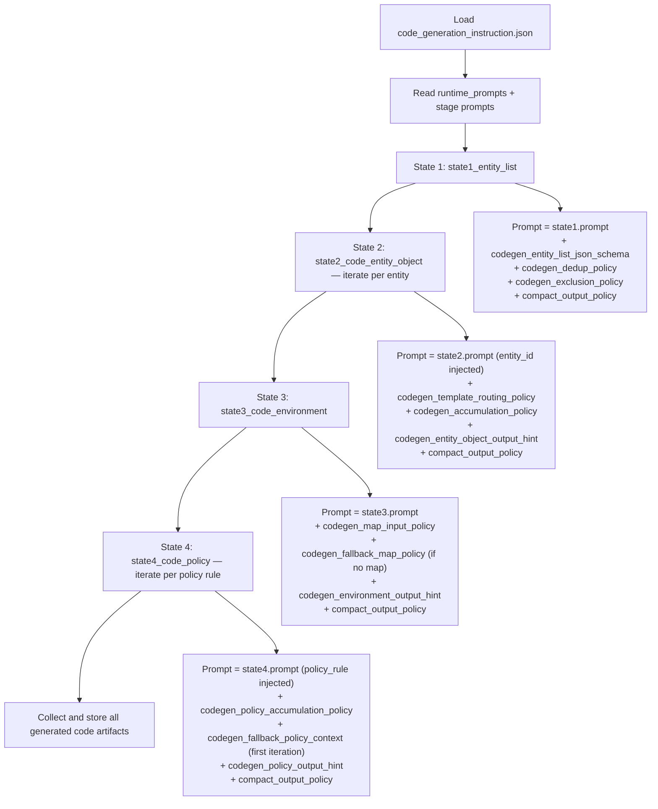

# Code Generation Prompt Flow

This document summarizes how code-generation prompts are assembled stage by stage from:

- `engine/backend/prompt/code_generation_instruction.json`
- `engine/backend/app/services/code_gen_runner.py`

## Mermaid Flow

## State Details

### 1. `state1_entity_list`
- **Purpose:** Extract a ranked, deduplicated entity list from causal data.
- **Inputs:** `causal_data`
- **Output:** JSON conforming to `codegen_entity_list_json_schema` — an array of entities with `id`, `label`, `type`, `frequency`, and `priority`.
- **Key policies applied:** `codegen_dedup_policy`, `codegen_exclusion_policy`
- **Fallback:** If frequency is indeterminate, applies `codegen_fallback_entity_list_policy` (priority by first appearance, warning flag added).

### 2. `state2_code_entity_object` *(iterative)*
- **Purpose:** Generate one Python entity class per iteration, sorted by `priority` ascending (most-mentioned first).
- **Inputs per iteration:** `causal_data`, `entity_list_json`, `already_generated_entities` (accumulated from prior iterations), `selected_template`
- **Output:** Raw Python class code for one entity — no fences, no prose.
- **Template routing:** `codegen_template_routing_policy` selects `entity_object_template` for all types except `policy` and `environment`.
- **Accumulation:** `codegen_accumulation_policy` governs how prior code is passed as context — for interface consistency only, never re-emitted.
- **Note:** Caller increments `already_generated_entities` after each successful iteration before passing to the next.

### 3. `state3_code_environment`
- **Purpose:** Generate the Environment Python class that spatially integrates all entities using map node data.
- **Inputs:** `code_entity_list` (all classes from State 2), `extracted_node_json` (from map extraction pipeline), `causal_data`
- **Output:** Raw Python environment class code.
- **Map input contract:** `codegen_map_input_policy` requires `extracted_node_json` — a raw map image is NOT accepted. Run map extraction first if only an image is available.
- **Fallback:** If `extracted_node_json` is unavailable, `codegen_fallback_map_policy` generates a spatial-stub class with a warning comment.

### 4. `state4_code_policy` *(iterative)*
- **Purpose:** Generate one Policy Python class per iteration for each behavior-change rule derived from causal data.
- **Inputs per iteration:** `code_entity_list`, `code_environment`, `causal_data`, `already_generated_policies` (accumulated from prior iterations)
- **Output:** Raw Python policy class code for one rule — no fences, no prose.
- **Accumulation:** `codegen_policy_accumulation_policy` prevents duplication of rules across iterations.
- **Fallback:** First iteration uses `codegen_fallback_policy_context` (empty prior list) — no special handling needed by caller.

## Template Routing Summary

| Entity Type   | Template Applied            |
|---------------|-----------------------------|
| `actor`       | `entity_object_template`    |
| `resource`    | `entity_object_template`    |
| `environment` | `environment_template`      |
| `policy`      | `policy_template`           |

## Fallback Behavior Summary

| Condition                          | Fallback Policy Applied                     |
|------------------------------------|---------------------------------------------|
| Ambiguous frequency in causal data | `codegen_fallback_entity_list_policy`       |
| `extracted_node_json` unavailable  | `codegen_fallback_map_policy`               |
| First policy iteration (no priors) | `codegen_fallback_policy_context`           |

## Reproduce Prompt Bodies Locally

Run the helper script at the repository root:

`python code_gen_prompt_replay.py`

Optional values can be provided to simulate runtime input:

`python code_gen_prompt_replay.py --causal-data "..." --entity-json '{"entities":[]}' --node-json '{"nodes":[]}' --entity-id "forklift" --policy-rule "emergency_stop"`
