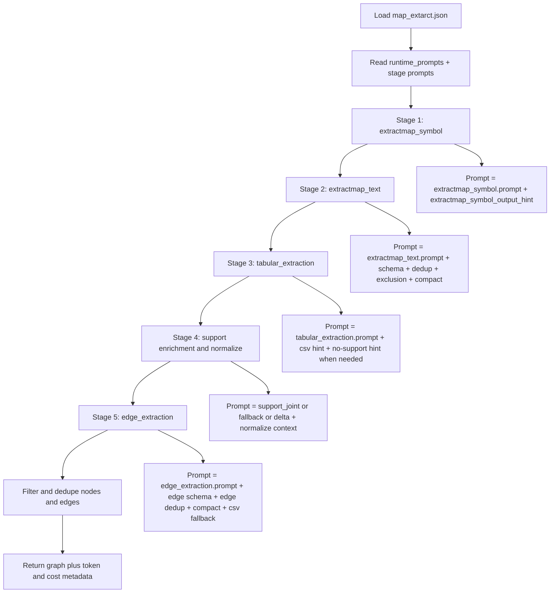

# Map Extract Prompt Flow

This document summarizes how map-extraction prompts are assembled stage by stage from:

- `engine/backend/prompt/map_extarct.json`
- `engine/backend/app/services/map_extract_runner.py`

## Mermaid Flow

## Stage Details

1. `extractmap_symbol`
- Purpose: detect legend symbols and notation.
- Assembled prompt includes the base stage prompt and concise markdown-table output hint.

2. `extractmap_text`
- Purpose: produce normalized node JSON from map text and support cues.
- Assembled prompt includes JSON schema, dedup policy, exclusion policy, and compact output policy.

3. `tabular_extraction`
- Purpose: extract support table content.
- Assembled prompt includes CSV-only output hint.
- If no support image exists, adds no-support hint.

4. Support enrichment and normalization
- Purpose: add missing node metadata from support artifacts and normalize shape.
- Uses joint/fallback/delta runtime prompts and normalize context guidance.

5. `edge_extraction`
- Purpose: build traversal edges using map plus extracted node set.
- Assembled prompt includes edge JSON schema, edge dedup policy, compact output policy, and CSV fallback hint.

## Reproduce Prompt Bodies Locally

Run the helper script at the repository root:

`python map_extract_prompt_replay.py`

Optional values can be provided to simulate runtime input text:

`python map_extract_prompt_replay.py --ocr-map "..." --symbol-table "..." --support-csv "..." --node-json '{"nodes":[]}'`
