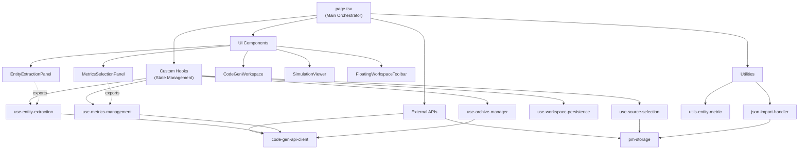
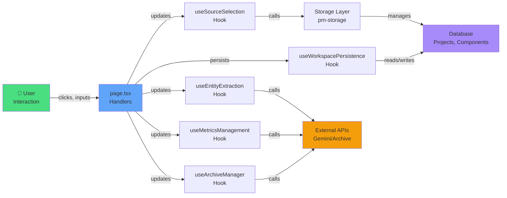
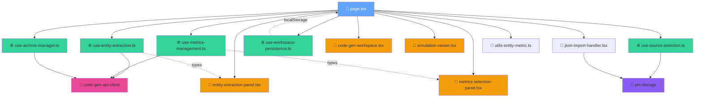
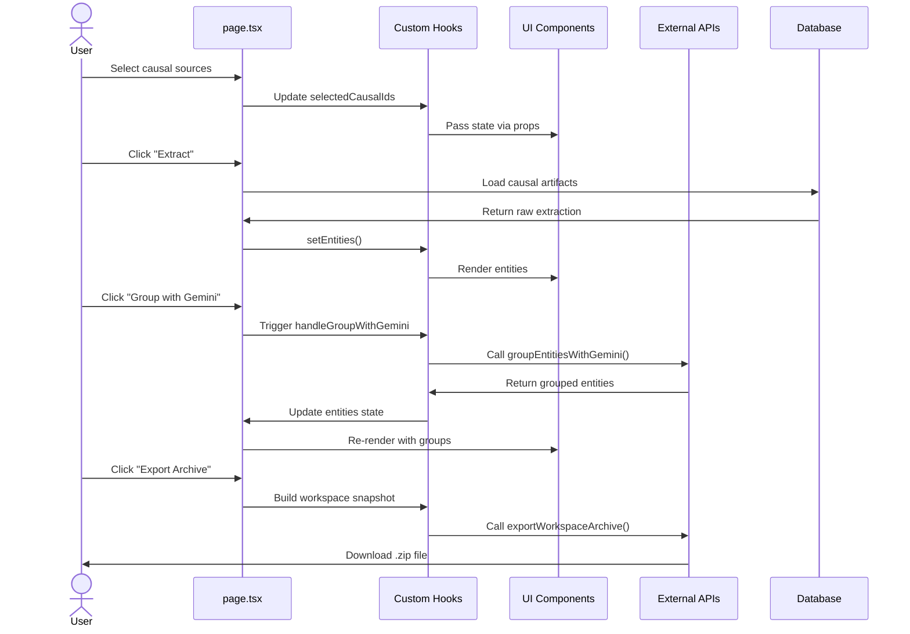
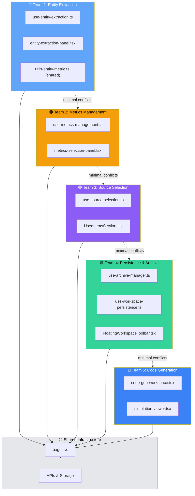
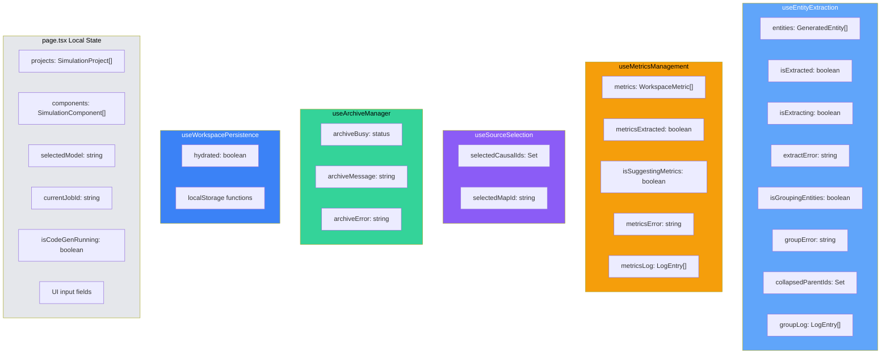
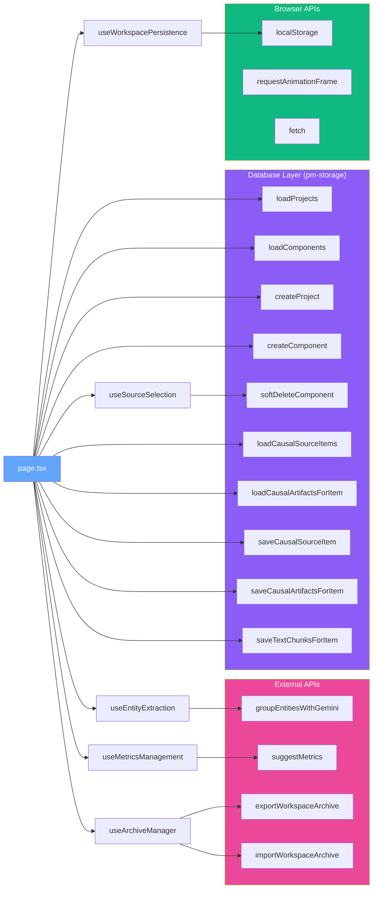

# Component Architecture - Mermaid Diagrams

## Diagram 1: High-Level Component Dependencies

## Diagram 2: State Flow Architecture

## Diagram 3: File Dependency Graph

## Diagram 4: Data Flow Pipeline

## Diagram 5: Team Ownership Map

## Diagram 6: Hook State Organization

## Diagram 7: API & Storage Integration

---

## Summary Statistics

- **Total Components**: 11 (1 main + 5 hooks + 5 UI)
- **Utility Files**: 2 (json-import-handler, utils-entity-metric)
- **Total Lines of Code**: ~3,030
- **State Management Lines**: ~715 (in hooks)
- **UI Component Lines**: ~1,050
- **Orchestration Lines**: ~1,000 (page.tsx)
- **API Integration Points**: 4 main APIs
- **Database Operations**: 10+ operations
- **Teams**: 5 (parallel development friendly)
